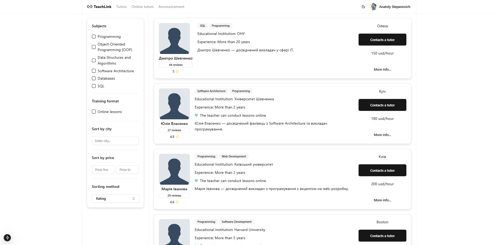
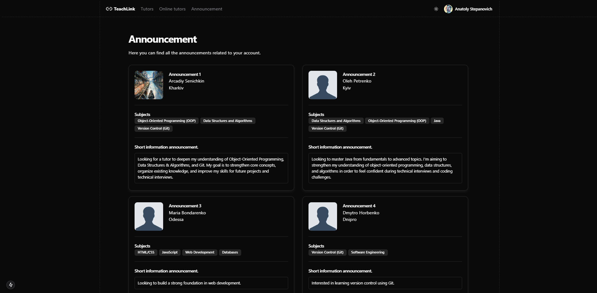
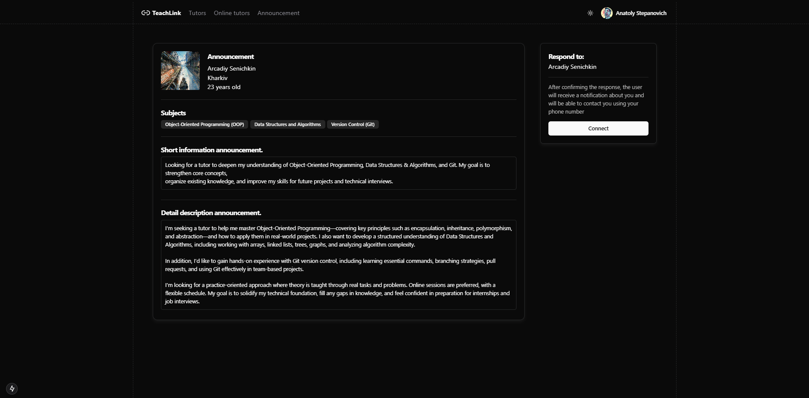
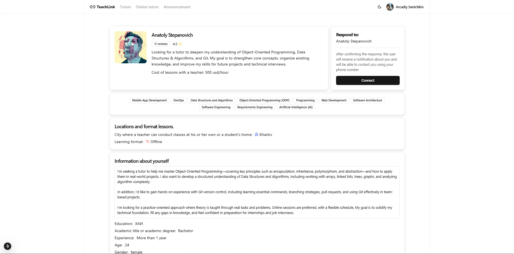

<table>
  <tr>
    <td width='1200px' height='140px'>
      

        
      

    </td>
  </tr>

  <tr>
    <td>
      

        
        
        
        
        
        
        
      

    </td>
  </tr>
</table>

<table>
  <tr>
    <td colspan="2">
      <h3 align='center'>TeachLink is an international web platform that unites tutors and students from all over the world.</h3>
    </td>
  </tr>
  <tr>
    <td width='550px'>

> - _**Creating teacher profiles**_
    </td>
    <td width='550px'>

> - _**Creating student profiles**_
    </td>
  </tr>
  <tr>
    <td>

> - _**Teacher review and rating system**_
    </td>
    <td>

> - _**Student announcement system**_
    </td>
  </tr>
  <tr>
    <td>

> - _**Notification system**_
    </td>
    <td>

> - _**And more...**_
    </td>
  </tr>
</table>

<table>
  <tr>
    <td>
      

    </td>
    <td>
      

    </td>
  </tr>
  <tr>
    <td>
      

    </td>
    <td>
      

    </td>
  </tr>
</table>

<table>
  <tr>
    <td colspan="2">
      <h2>🔧 How It Works</h2>
    </td>
  </tr>

  <tr>
    <td colspan="2">

> - _**To ensure quality matchmaking, both students and tutors must first create and complete their profiles.**_
    </td>
  </tr>

  <tr>
    <td colspan="2">
      <h3>
      
_**For Tutors:**_
      </h3>
    </td>
  </tr>

  <tr>
    <td colspan="2">

> - _**Subjects they teach**_  

> - _**Brief and detailed personal description**_  

> - _**Teaching experience**_  

> - _**Lesson price**_
    </td>
  </tr>

  <tr>
    <td colspan="2">
      <h3>
      
_**Important:**_
      </h3>
    </td>
  </tr>

  <tr>
    <td colspan="2">

> - _**A tutor's profile already serves as an announcement. There's no need to create a separate post — simply enable the visibility of your profile so that students can find it.**_
    </td>
  </tr>

  <tr>
    <td colspan="2">
      <h3>
      
_**For Students:**_
      </h3>
    </td>
  </tr>

  <tr>
    <td colspan="2">

> - _**Create and complete their profile**_  

> - _**Publish an announcement that includes:**_
    </td>
  </tr>

  <tr>
    <td>

> - _**A brief summary of the type of tutor they are looking for**_
    </td>
    <td>
      
> - _**A detailed description of their expectations**_
    </td>
  </tr>

  <tr>
    <td colspan="2" align="center">
      
_**This two-sided system allows for more efficient filtering and matching.**_
    </td>
  </tr>
</table>
